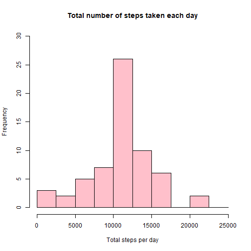

## Setting working directory and loading data    

```r
setwd("C://Users//dell//Desktop//coursera minor//health data")
activity<-read.csv("activity.csv")
library(ggplot2)
```

```
## RStudio Community is a great place to get help: https://community.rstudio.com/c/tidyverse
```
## Mean total nuber of steps taken per day  

```r
activity_total_steps <- with(activity, aggregate(steps, by = list(date), FUN = sum, na.rm = TRUE))
names(activity_total_steps) <- c("date", "steps")
hist(activity_total_steps$steps, main = "Total number of steps taken per day", xlab = "Total steps taken per day", col = "lightblue", ylim = c(0,20), breaks = seq(0,25000, by=2500))
```


  
  
Mean total number of steps taken per day:

```r
mean(activity_total_steps$steps)
```

```
## [1] 9354.23
```
Median of the total number of steps taken per day:

```r
median(activity_total_steps$steps)
```

```
## [1] 10395
```
## The average daily activity pattern

```r
average_daily_activity <- aggregate(activity$steps, by=list(activity$interval), FUN=mean, na.rm=TRUE)
names(average_daily_activity) <- c("interval", "mean")
plot(average_daily_activity$interval, average_daily_activity$mean, type = "l", col="darkblue", lwd = 2, xlab="Interval", ylab="Average number of steps", main="Average number of steps per intervals")
```


  
5-minute interval with average maximum number of steps across all days

```r
average_daily_activity[which.max(average_daily_activity$mean), ]$interval
```

```
## [1] 835
```
## Imputing missing values  
The total number of missing values in the dataset are:  

```r
sum(is.na(activity$steps))
```

```
## [1] 2304
```
  
Using the mean/median for that day, for filling missing values in dataset.   

```r
imputed_steps <- average_daily_activity$mean[match(activity$interval, average_daily_activity$interval)]
```
## New dataset

```r
activity_imputed <- transform(activity, steps = ifelse(is.na(activity$steps), yes = imputed_steps, no = activity$steps))
total_steps_imputed <- aggregate(steps ~ date, activity_imputed, sum)
names(total_steps_imputed) <- c("date", "daily_steps")
hist(total_steps_imputed$daily_steps, col = "pink", xlab = "Total steps per day", ylim = c(0,30), main = "Total number of steps taken each day", breaks = seq(0,25000,by=2500))
```


  
Mean total number of steps taken per day:

```r
mean(total_steps_imputed$daily_steps)
```

```
## [1] 10766.19
```
Median of the total number of steps taken per day:

```r
median(total_steps_imputed$daily_steps)
```

```
## [1] 10766.19
```
  
Differences in activity patterns between weekdays and weekends:

```r
activity$date <- as.Date(strptime(activity$date, format="%Y-%m-%d"))
activity$datetype <- sapply(activity$date, function(x) {
        if (weekdays(x) == "Saturday" | weekdays(x) =="Sunday") 
                {y <- "Weekend"} else 
                {y <- "Weekday"}
                y
        })
activity_by_date <- aggregate(steps~interval + datetype, activity, mean, na.rm = TRUE)
ggplot(activity_by_date, aes(x = interval , y = steps, color = datetype)) +geom_line() +labs(title = "Average daily steps by type of date", x = "Interval", y = "Average number of steps") + facet_wrap(~datetype, ncol = 1, nrow=2)
```


